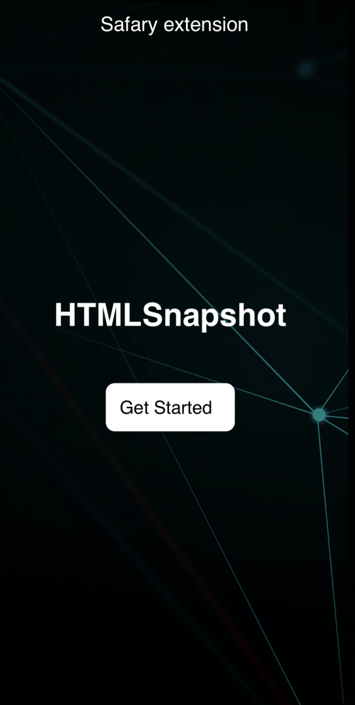
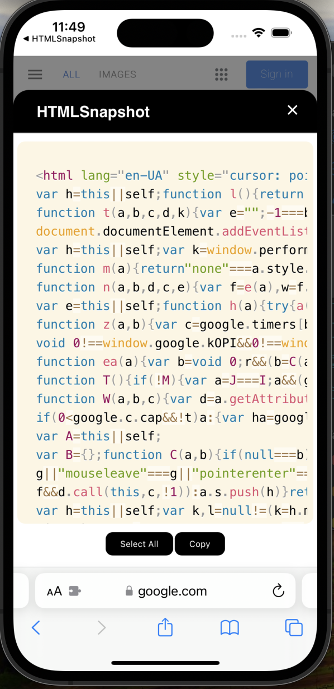

# HTMLSnapshot

HTMLSnapshot is a mobile Safari extension designed to empower web developers and curious minds by displaying the HTML code of any website directly within Safari. Built using React Native and React, this extension offers a seamless and efficient way to inspect and interact with web page structures on the go.

## Features

- **Instant HTML Code Display**: Easily view the HTML code of the current webpage with a single tap.
- **User-Friendly Interface**: A clean and intuitive interface that makes web inspection straightforward and accessible.
- **Compatibility**: Designed specifically for mobile Safari, ensuring a smooth experience for iPhone and iPad users.

## Getting Started

To get started with HTMLSnapshot, follow these simple installation steps:

1. **Download and Install**: First, download the HTMLSnapshot extension from the App Store.
2. **Enable the Extension in Safari**: Go to Safari's settings, navigate to the Extensions menu, and enable HTMLSnapshot.
3. **Enjoy Browsing**: Open any website in Safari, activate the extension, and instantly view the site's HTML code.

## Usage

Here's how you can use HTMLSnapshot to inspect web pages on the go:

1. Navigate to the website you wish to inspect.
2. Tap on the share button in Safari's toolbar.
3. Select HTMLSnapshot from the list of extensions.
4. The HTML code will be displayed in a new tab, where you can interact with the content as needed.

## Screenshots

Here are some screenshots demonstrating HTMLSnapshot in action:

## Demo Video

Watch this video to see HTMLSnapshot in action and learn more about its features:

</a>

## Contributing

We welcome contributions! If you have suggestions for improvements or new features, feel free to open an issue or submit a pull request.

## Feedback

Your feedback is valuable to us. If you encounter any issues or have suggestions for enhancing HTMLSnapshot, please don't hesitate to contact us.

## License

HTMLSnapshot is released under the MIT License. See the LICENSE file for more details.
